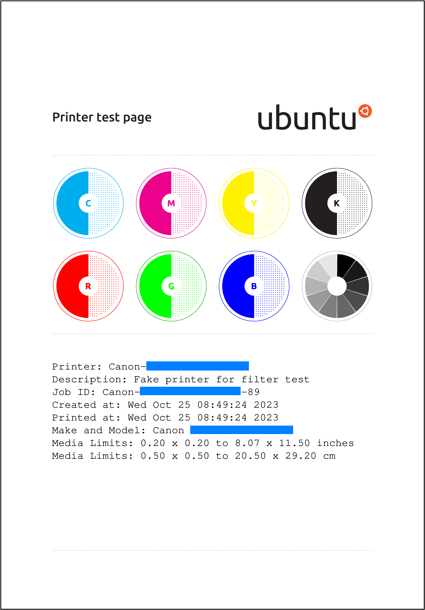
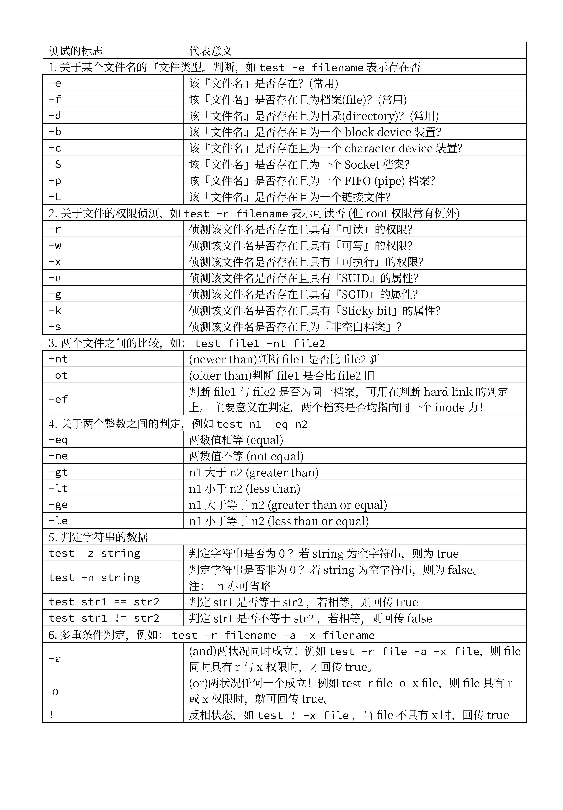

## 简介

基于 [fruitsamples/SampleRaster](https://github.com/fruitsamples/SampleRaster) 的个人练手项目。

一坨用来示范打印机的 CUPS Raster filter 工作流程以及将 CUPS Raster 格式转为 bitmap 格式的源文件。采用 GNU Affero General Public License (下称 AGPL 3.0) 开源。

目前代码已经基本完成。您可以在遵循 [AGPL 3.0](./COPYING.md) 的协议下用这些代码做您任何想做的事情。

## 编译

```sh
gcc -g `cups-config --cflags` ./rastertosample.c ./common.c `cups-config --libs` -o ./rastertosample
```

```sh
gcc -g `cups-config --cflags` ./bitmap.c ./rastertobitmap.c `cups-config --libs` -o ./rastertobitmap
```

```sh
gcc -g `cups-config --cflags` ./bitmap.c ./rastertobitmapfile.c `cups-config --libs` -o ./rastertobitmapfile
```

## 使用方法

`sample.h`, `common.c`, `rastertosample.c` 为一组源文件，其功能是将 raster 文件的内容输出到标准输出。

`bitmap.h`, `bitmap.c`, `rastertobitmap.c`, `rastertobitmapfile.c` 为一组源文件，其功能是将 raster 文件转换为 bitmap 格式；`rastertobitmap` 会将转换后的内容输出到标准输出，`rastertobitmapfile` 会直接将转换后的内容输出到文件。

可用的命令示例：

```sh
./rastertobitmap 114514 lit test - - ./tiger.cupsraster > ./tiger.bmp
```

## 已知缺陷

1. 未在 Linux x86_64 以外的平台进行测试。

2. 不支持非 8、16 的位深，以及非 RGB、SRGB、W 的色彩空间。

3. 头文件代码用到了涉及 GCC 特性的语法，未在 GCC 以外的编译器进行测试，其他编译器能否通过编译尚不明确。

## 免责说明

(1) 此软件为演示工具，算法为个人想法，代码仅供参考，不代表 CUPS 官方或者标准实现。

(2) 此软件的代码可能存在潜在的缺陷，如不可移植或者其他环境不通过编译的情况。根据 [AGPL 3.0](./COPYING)，代码作者不会对特定用途做出任何担保。烦请根据您的实际环境自行解决这些问题。如代码有算法层面的问题，请提 issue 或者联系我。

(3) 根据 Free Software Foundation 的要求，如产生了涉及到 AGPL 3.0 的法律纠纷，请以 Free Software Foundation 发布的 AGPL 3.0 英文原版为准，而不是翻译版或者其他非 Free Software Foundation 发布的版本。Free Software Foundation 发布的 AGPL 3.0 可以在 <https://www.gnu.org/licenses/agpl-3.0.md> 找到；本软件使用的版本 ([./COPYING](./COPYING)) 是对 Free Software Foundation 发布版本的直接拷贝。

## Leissoft

计划以后自己所有以 `Leis` 开头的软件，在处理完可能会有的版权冲突后，都以 AGPL 3.0 或者更新版的协议开源。

这是我实际上的第一个开源软件，请多关照。

## 更新履历

### 程序员节, 2023 v2.0

1. 重写部分逻辑代码。

2. 去除部分无用功能。

其实开发者无需重写 CUPS Raster Ver 2 格式的解压算法，因为这一切让 CUPS 库实现了。

3. 增加对 8 位灰度图片的支持。

4. 优化进程通信，可以通过管道将 Raster 流数据传输到程序。

### 23.10.23 v1.0

已完成代码的编写及测试，可以使用。

### 23.10.10

开始软件试作。目前所有的代码均为未完工状态。

## 一些打印任务的测试结果

（为便于上传而转换为 PNG 格式，实际输出仍为 BMP 格式）






---

Leisquid Li

2023.10.10

更新于 23.12.21
